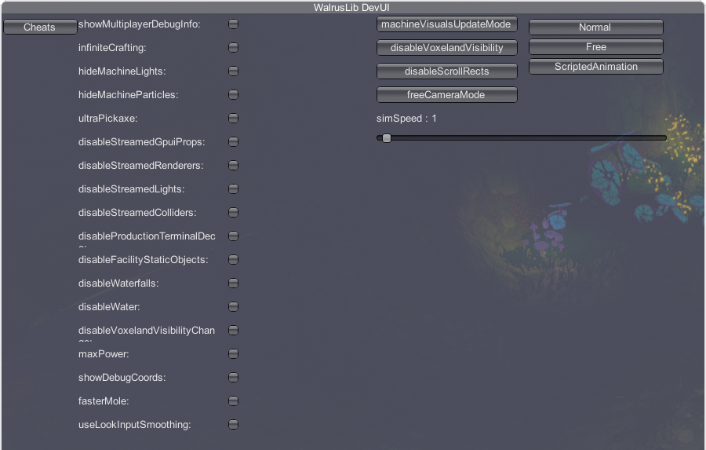

# CheatEnabler

## About

Cheat Enabler is designed to create a user-friendly UI to utilize the built-in cheats for Techtonica

These cheats are located in `PlayerCheats`.

***Whilst these cheats are visible in the UI, not all of them are functional.***

## Usage

To use the CheatEnabler menu, press (CTRL + SHIFT + Y) on your keyboard to open the WalrusLib Dev UI, then select the `Cheats` tab

## Installation

### Requirements

- [BepInEx](https://github.com/BepInEx/BepInEx/releases/tag/v5.4.21) v5.4.21
- [WalrusLib](https://github.com/StarTechtonicLabs/WalrusLib/releases) v0.1.0 or higher

### Steps

Download the latest version of `CheatEnabler.zip` from the [releases tab](https://github.com/StarTechtonicLabs/CheatEnabler/releases) and extract it into your `BepInEx/plugins` directory.

## Screenshots

